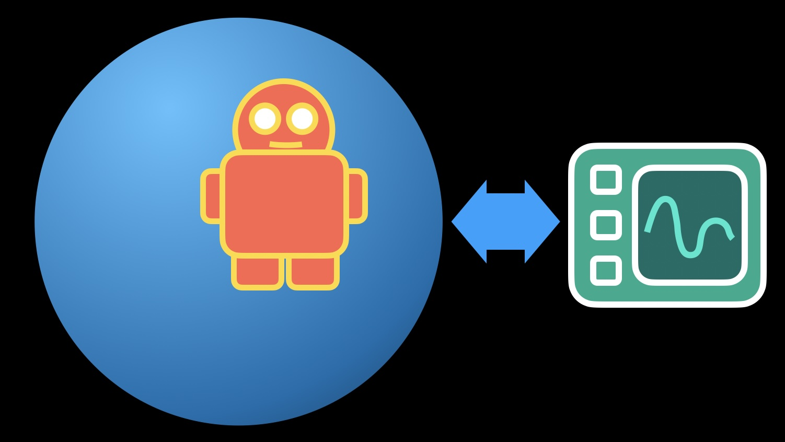
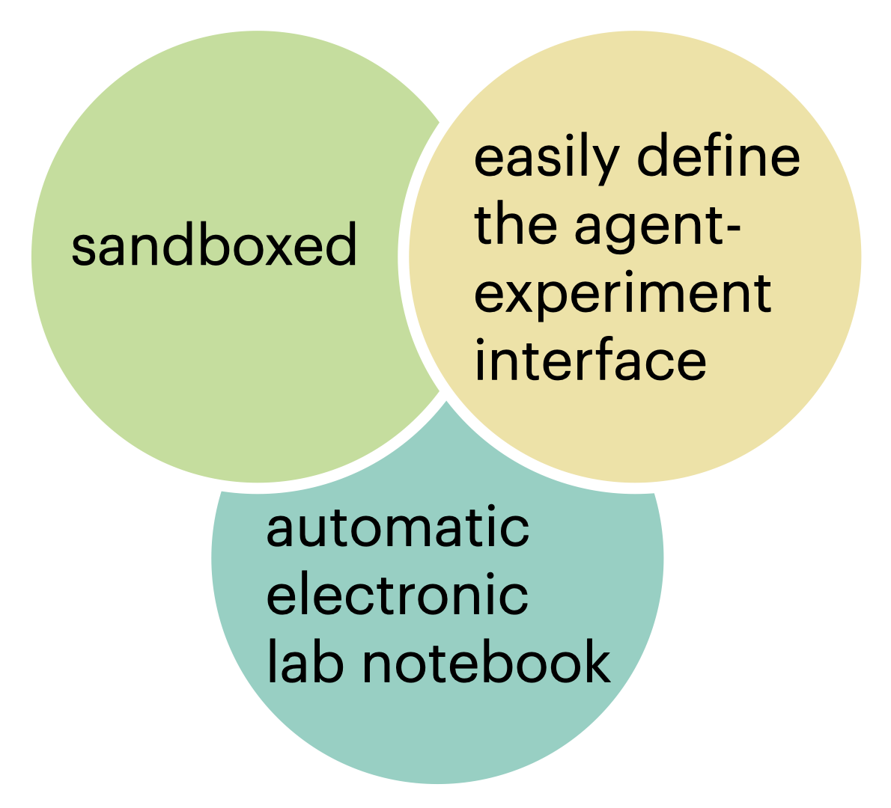
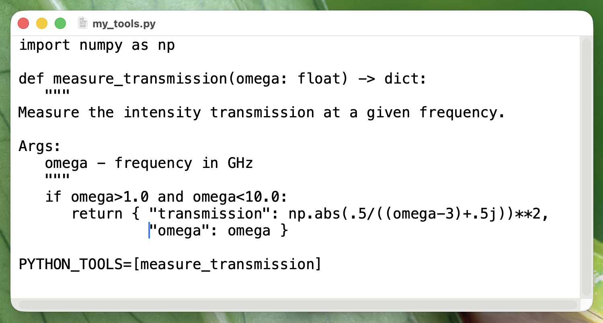
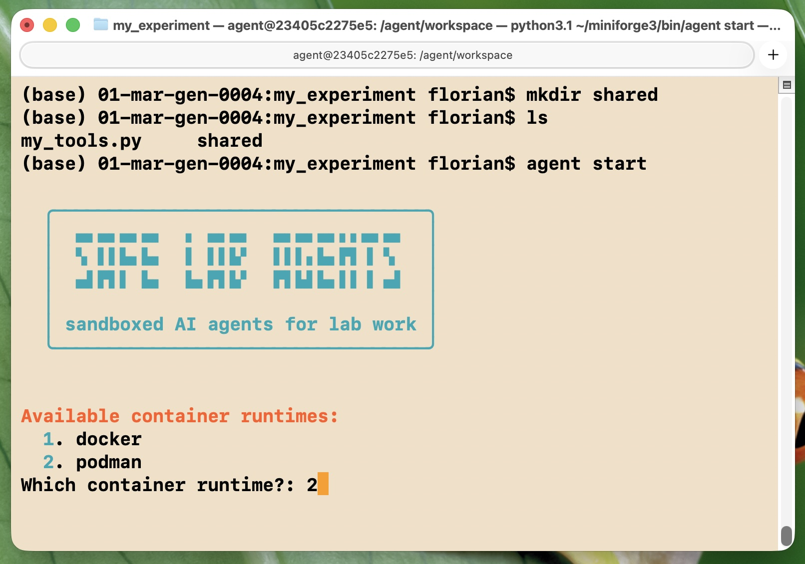
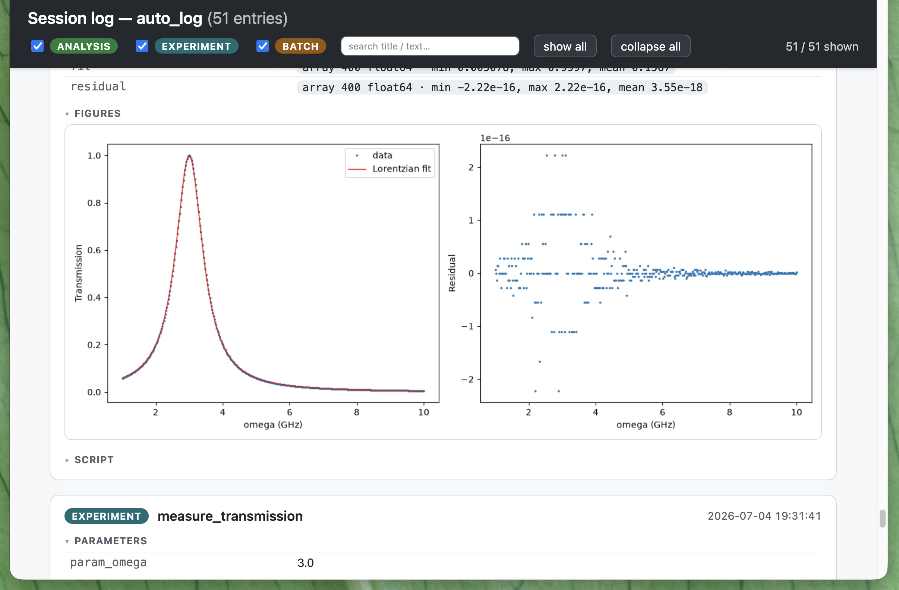

<!--- background --->

# Safe Lab Agents: Sandboxed AI Agents for Lab Work

<!--- centered 80% --->

Safely run an AI agent inside a sandbox to control a scientific experiment or a numerical simulation. Define the interface to the experiment easily in a few lines. Automatically obtain electronic lab notebook documentation of the entire runs. Supports Claude Code and OpenClaw as agent frameworks.

By Maximilian Nägele and Florian Marquardt. Made at the [Max Planck Institute for the Science of Light](https://mpl.mpg.de/divisions/marquardt-division/research) in Germany. Open source and forever free. First release July 2026.

<!--- figure, vector-graphics, centered 50%: three circles with main selling points --->

---

## Install the package

Simply use pip install. Also needed: Docker or Podman (for the sandboxing) and an account/API key for Claude Code or Open Claw.

<!--- code for the terminal --->
> pip install safe-lab-agents

Look at an [example setup](https://github.com/MaxNaeg/safe_lab_agents/tree/main/example_setup).

## Write an interface using simple python functions

## Launch the agent

<!--- code for the terminal --->
> agent start --task "Characterize this setup!"

The setup wizard guides you through a few questions, installs everything needed inside the agent's sandbox, and launches the AI agent, here in autonomous mode.

## Browse the results

Conveniently browse both the full AI agent exploration history, as well as all experimental data, analysis scripts, and resulting figures. Easy export as an electronic lab notebook (.eln) document.

---

## See it in action

---

## Explore an example run

[Full conversation of the agent calibrating an experiment](https://raw.githack.com/MaxNaeg/safe_lab_agents/main/example_setup/shared_calibration_example/conversation_safe_lab_agents.html)

[Automatically generated lab notebook report](https://raw.githack.com/MaxNaeg/safe_lab_agents/main/example_setup/shared_calibration_example/auto_log/report_safe_lab_agents.html)

[Example setup code](https://github.com/MaxNaeg/safe_lab_agents/tree/main/example_setup)

---

## Learn more

[github.com/MaxNaeg/safe_lab_agents](https://github.com/MaxNaeg/safe_lab_agents/)

---

## Join the conversation

[Safe Lab Agents discussions forum](https://github.com/MaxNaeg/safe_lab_agents/discussions)

